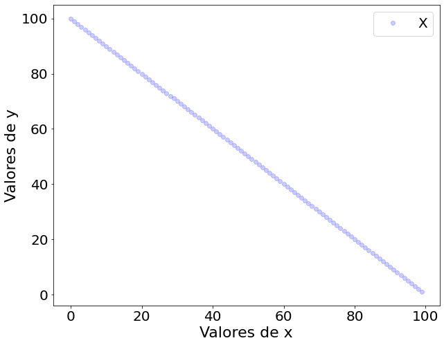

# MATPLOTLIB

* Para iniciar criaremos um dado fake x e y.


```python
import numpy as np
x = np.arange(0, 100, 1)
y = np.arange(99, 0, -1)
```


### Usando ```plt.plot```

```python
# Importamos a biblioteca do matplotlib
import matplotlib.pyplot as plt
# Desenhamos o gráfico
plt.figure(figsize=(10,8))
plt.plot(x, y, linestyle='None', marker='o', color='blue', alpha = 0.2, label='X')
plt.xlabel('Valores de x', fontsize = 22)
plt.ylabel('Valores de y', fontsize= 22)
plt.xticks(fontsize=20, rotation=0)
plt.yticks(fontsize=20, rotation=0)
plt.legend(loc="upper right", fontsize = 20)
#plt.xlim(0,200)
#plt.ylim(0,200)
```




# SEABORN


