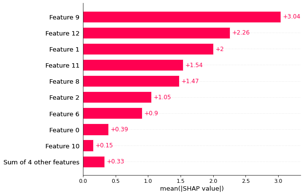

# Explicando modelos de machine learning usando SHAP

**Alvaro J. Lopez** 

Neste artigo vou a ensinar como usar a biblioteca SHAP (SHapley Additive exPlanations) para interpretar os modelos de machine learning.

Os modelos de machine learning são muitas vezes usados como caixas pretas, ou seja após treinado o modelo 
é muito dificil extrair informações simples do modelo com a finalidade de explicar como cada preditor
contribui para o modelo.

Aqui vamos a usar um modelo previsamente treinado usando redes neurais (Veja o [link](./redes_neurais_regressão.md)). Esse modelo esta armazenado no objeto  ``` model.nn```

A continuação vou mostrar o passo a passo para implementar o SHAP em python.

* Instalamos as librerias

```python
pip install shap
```


* Importamos as librerias

```python
import shap
```

* Inicializamos o SHAP

```python
shap.initjs()
```

* Calculamos os SHAP values

```python
# Fits the explainer
explainer = shap.Explainer(model_nn.predict, X_test)
# Calculates the SHAP values - It takes some time
shap_values = explainer(X_test)
```

Observação: Para calcular o ```explainer``` de um modelo de redes neurais usamos o ```.predict```. Caso for um modelo linear não será necessário.


Com os ```shap_values``` podemos criar varios tipos de gráficos que nos irão auxiliar na compreensão sobre o modelo. A continuação vou mostrar os gráficos que podem ser criados usando a libreria SHAP.


* Bar plot

```python
shap.plots.bar(shap_values)
```



* Summary plot

```python
shap.summary_plot(shap_values)
```


* Waterfall plot

```python
shap.plots.waterfall(shap_values[0])
```

